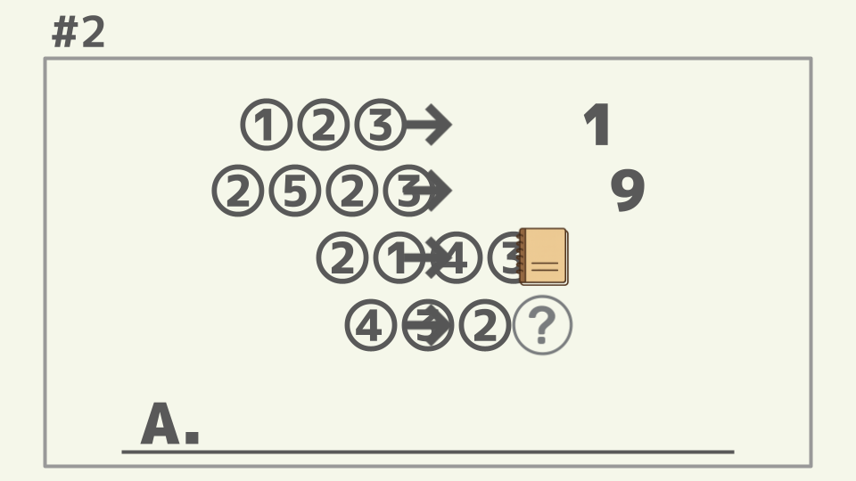
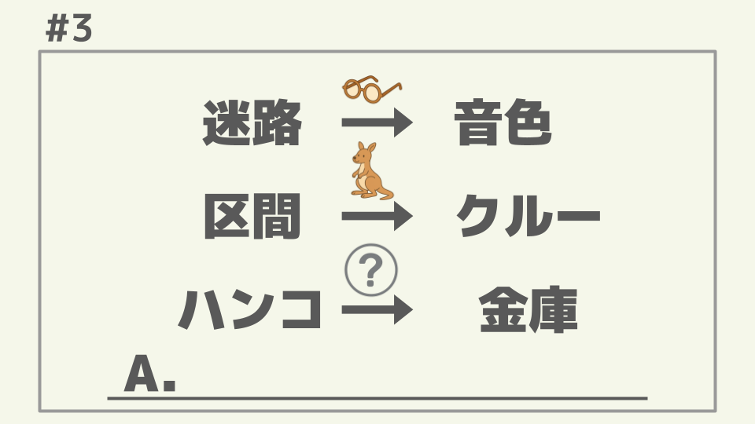
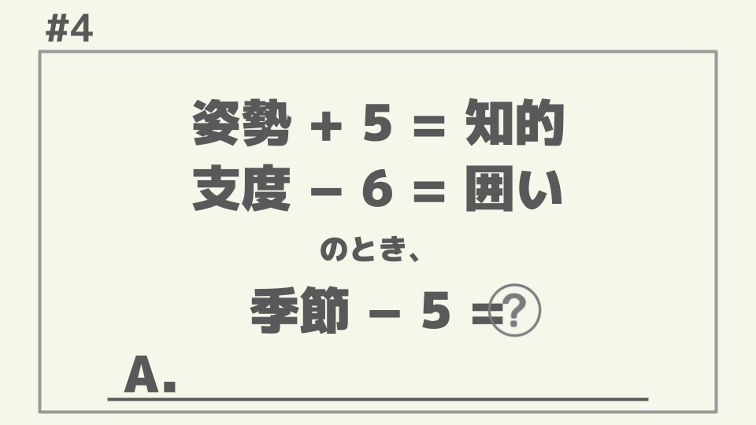
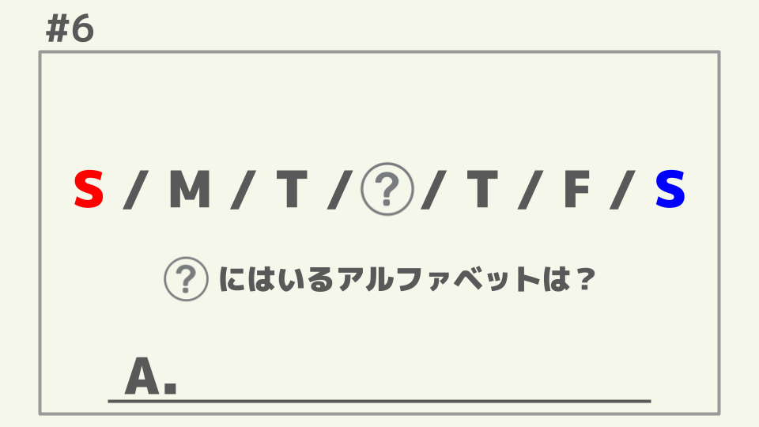
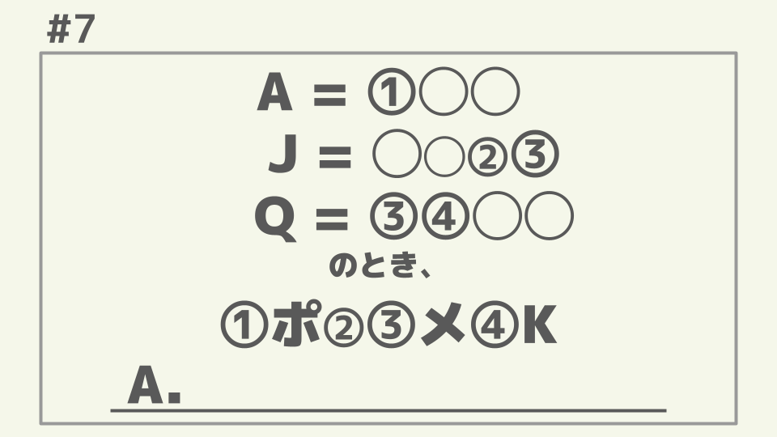
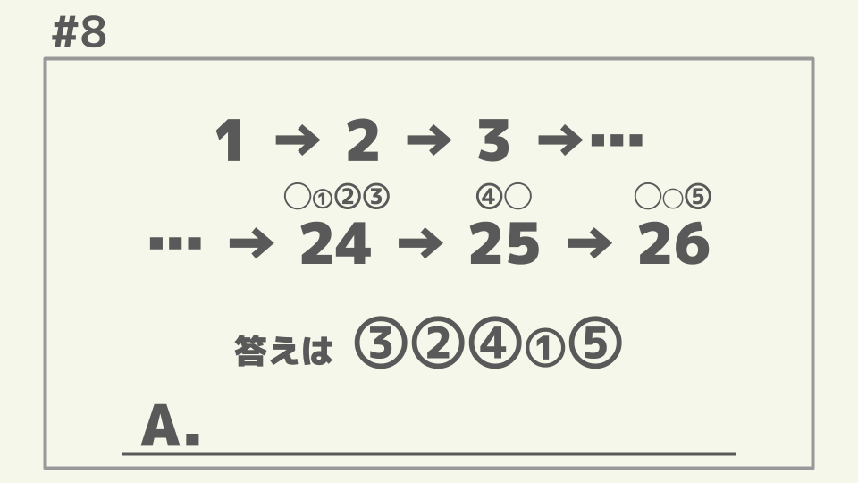
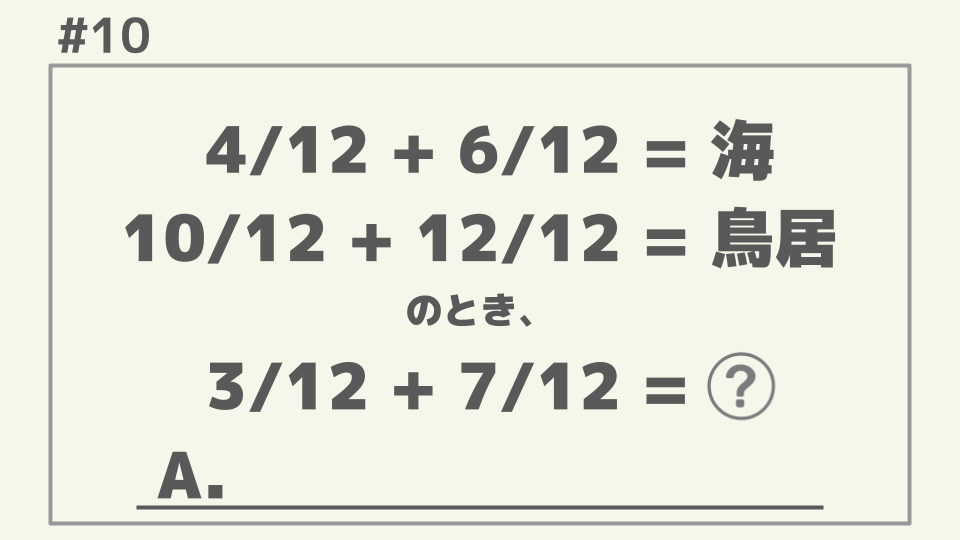
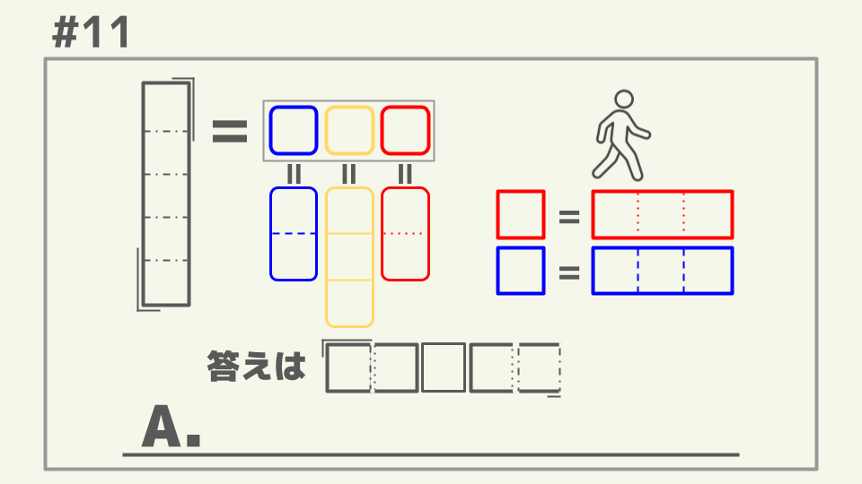
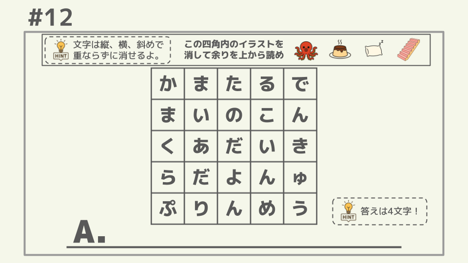

# Riddle LLM Benchmark

日本語の謎解きタスクでLLMの推論能力を評価するベンチマークです。画像ベースの10問の謎解きクイズを使用して、LLMの性能を評価します。

## 特徴

- 画像ベースの日本語謎解き問題10問
- 複数のLLMプロバイダーに対応（OpenAI、Gemini、Bedrock/Claude）
- 推論プロセスの可視化オプション
- Dockerベースの環境

## Riddles

このベンチマークで使用される10問の謎です。

| ID | 画像 | 正解例 |
|---|---|---|
| 001 |  | <details><summary>クリックして表示</summary>えーあい、エーアイ、AI</details> |
| 002 |  | <details><summary>クリックして表示</summary>10</details> |
| 003 |  | <details><summary>クリックして表示</summary>はがき、ハガキ、葉書</details> |
| 004 |  | <details><summary>クリックして表示</summary>いけす、生簀、生け簀</details> |
| 005 |  | <details><summary>クリックして表示</summary>いちじく、イチジク</details> |
| 006 |  | <details><summary>クリックして表示</summary>W</details> |
| 007 |  | <details><summary>クリックして表示</summary>エポックメイキング</details> |
| 008 |  | <details><summary>クリックして表示</summary>スクワット</details> |
| 009 |  | <details><summary>クリックして表示</summary>□</details> |
| 010 |  | <details><summary>クリックして表示</summary>とらうま、トラウマ</details> |
| 011 |  | <details><summary>クリックして表示</summary>しれいとう、司令塔</details> |
| 012 |  | <details><summary>クリックして表示</summary>かまくら、カマクラ</details> |

## 使い方

事前に .env 等で環境変数に各種API_KEYをセットしてください。

### ローカル

```bash
# 依存関係をインストール
uv sync

# ベンチマークを実行
uv run riddle_benchmark --model gpt-4o

# reasoning: high, かつ思考過程出力
uv run riddle_benchmark --model gpt-4o --reason --extra-params "{\"reasoning_effort\": \"high\"}" --output-dir hoge
```

### Docker

```bash
# 開発コンテナを起動
docker compose up -d

# コンテナ内でベンチマークを実行
docker compose exec dev uv run riddle_benchmark --model gpt-4o

# reasoning: high, かつ思考過程出力
docker compose ecex dev uv run riddle_benchmark --model gpt-4o --reason --extra-params "{\"reasoning_effort\": \"high\"}" --output-dir hoge
```

## 結果 (2025/12)

- openai
    - openai/gpt-4o
    - openai/gpt-5.1-2025-11-13
    - openai/gpt-5-2025-08-07
    - openai/gpt-5-mini-2025-08-07
    - openai/gpt-5-nano-2025-08-07
- gemini
    - gemini/gemini-3-pro-preview
    - gemini/gemini-2.5-pro
    - gemini/gemini-2.5-flash
    - gemini/gemini-2.5-flash-lite
- bedrock
    - bedrock/anthropic.claude-opus-4-5-20251101-v1:0
    - bedrock/anthropic.claude-haiku-4-5-20251001-v1:0
    - bedrock/anthropic.claude-sonnet-4-5-20250929-v1:0
